# rao-training

In this RAO training, we will learn how to create a CRAC object in order to optimize the following network.  
In this simple network, all production (1500 MW) is on node `NNL1AA11` and all consumption (1500 MW) on node `FFR1AA11`.  
We will consider the following critical elements: 
- line `NNL2AA11 BBE3AA11 1` has a maximum allowed flow of 500 MW, in basecase and after all contingencies
- line `FFR2AA11 FFR3AA11 1` has a maximum allowed flow of 1200 MW, in basecase and after all contingencies

You can use methods 'drawNetwork' if you want to draw the network.

## Preventive RAO
As you can see in the above diagram, in basecase, line `NNL2AA11 BBE3AA11 1` is above its allowed limit.  
Let's try to solve this.  
1. Create a CRAC with a preventive, an outage, and a curative instant.  
   Change the code starting at this line:
    ~~~java
    Crac crac = null;
    ~~~
2. Create an optimized preventive CNEC on line `NNL2AA11 BBE3AA11 1`, limit it to -500/+500 MW
3. Run the RAO and see what happens
4. Create a preventive network action that closes `NNL2AA11 BBE3AA11 2`. Hopefully, this shall create the following case, 
   relieving the critical line:  
   
5. Run the RAO to check that it activates this PRA

## N-1 curative RAO
Let's study the N-1 case where we lose line `FFR2AA11 NNL3AA11 1`. In this case, even with both `NNL2AA11 BBE3AA11 1` 
and `NNL2AA11 BBE3AA11 2` connected, the flow on critical line `NNL2AA11 BBE3AA11 1` is too high.

1. Add to the CRAC a contingency `co1` with the loss of line `FFR2AA11 NNL3AA11 1`
2. Create a curative CNEC on line `NNL2AA11 BBE3AA11 1`, after `co1`, and limit it to -500/+500 MW
3. Run the RAO and see what happens
4. Add a CRA to close `NNL2AA11 BBE3AA11 3`. Hopefully, this shall relieve the critical line:
   
5. Run the RAO to check that it activates this CRA

## N-2 curative RAO
Now let's study the N-2 case, where we lose both `FFR2AA11 NNL3AA11 1` and `FFR1AA11 FFR3AA11 1`.  
In this case, both critical lines `NNL2AA11 BBE3AA11 1` and `FFR2AA11 FFR3AA11 1` would go over their limits.  

1. Add to the CRAC a contingency `co2` on the loss of `FFR2AA11 NNL3AA11 1` and `FFR1AA11 FFR3AA11 1`
2. Create a curative CNEC on line `NNL2AA11 BBE3AA11 1`, after `co2`, limit it to -500/+500 MW
3. Create a curative CNEC on line `FFR1AA11 FFR2AA11 1`, after `co2`, limit it to -1200/+1200 MW
4. Run the RAO and see what happens
5. Add a curative generator range action (re-dispatching), with the following keys:
    - `NNL1AA11_generator` : 1.0
    - `FFR1AAA11_generator` : -1.0
   In a range of 1200 to 1800, for example.  
   This means that the RAO will be able to choose the best injection `value` in the range of [1200 - 1800], making sure that
   `NNL1AA11_generator_activePower = -FFR1AAA11_generator_activePower = value`, like in a classic re-dispatching action.
6. Run the RAO and see what happens.  
   You shall see that the RAO chooses first to change the injections, then to close the NL-BE line:
   
   
   

## Outage CNEC
1. Re-create the preventive & N-1 case, in a new CRAC
2. Replace the curative CNEC with an outage CNEC
3. Run the RAO and see what happens
4. Change the CRA that closes `NNL2AA11 BBE3AA11 3` to a PRA
5. Run the RAO and see what happens

## Unsecure network
1. Re-create N-2 case
2. Remove one of the two curative remedial actions
3. Run the RAO and see what happens